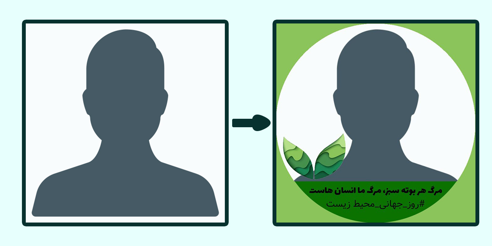

# profile_telegram_bot
When the user send a picture to the bot. At the first, it will crop an square picture from the center of the picture. Then, it will add the foreground.png to the square picture.
Finally the bot send the result back to the user.



Please support me by starring this repository.

# Initialize Database
Change PASSWORD in second line with a powerful password including uppercase and lowercase letters, numbers and symbols

```sql
CREATE DATABASE profilebot;
CREATE USER 'profilebot'@'localhost' IDENTIFIED BY 'PASSWORD';
GRANT ALL PRIVILEGES ON profilebot.* TO 'profilebot'@'localhost';
FLUSH PRIVILEGES;
```

# Create config.ini file
Rename _config.ini.sample_ file to _config.ini_ .
in _config.ini_ file, at telegram section assign token with your telegram bot token. Also assign support_id with your personal account id. You can find your account id from t.me/myidbot.
in _config.ini_ file, at mysql section change password with the password you entered at previous step for database user.

# Run Bot Service
In bot.service change "/path/to/file"s with path of your project
Move bot.service to /usr/lib/systemd/system/profile-bot.service
Execute bellow commands

```bash
systemctl daemon-reload
service profile-bot start
service profile-bot enable
```
